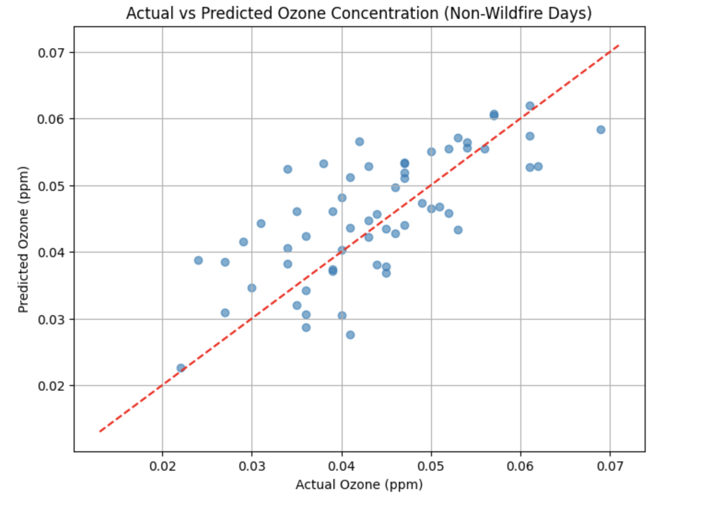

# Southern California Wildfire ML Prediction

This is the repository for my attempt to use a random forest regression model to predict the magnitude of PM2.5 and ozone concentraions before and during a wildfire. The notebook is located under the name "WildfireProject_Final.ipynb".

## Variables Used
The following variables were used in the implementation of the random forest regression model:

## Model Output

The red line above signifies perfect prediction by the model.
