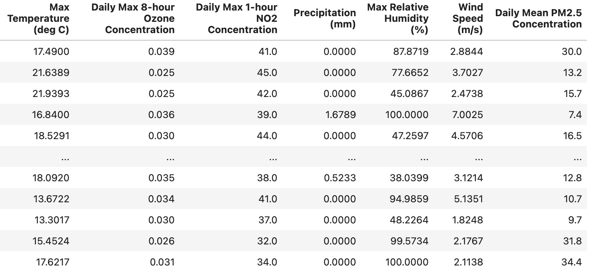

# Prediction of Ozone and PM 2.5 levels before and after Southern California Wildfires

I use a random forest regression model to predict the magnitude of PM2.5 and ozone concentrations before and during a wildfire. The model was able to predict better results for both compunds on non-wildfire days. Wildfire days had a singificantly larger margin of error.

The notebook is located under the name "WildfireProject_Final.ipynb".

## Variables Used
The following variables were used in the implementation of the random forest regression model:

## Model Output

The red line above signifies perfect prediction by the model.
## Notes
The variables utilized in this model are not an exhaustive list; More variables could be incorporated into the model to potentially increase prediction accuracy.
## Sources
[GridMet Data](https://www.climatologylab.org/gridmet.html): Abatzoglou, J. T. (2013), Development of gridded surface meteorological data for ecological applications and modelling. Int. J. Climatol., 33: 121–131.

<a href=\"https://www.epa.gov/outdoor-air-quality-data\">U.S EPA Air Quality Data</a>: US Environmental Protection Agency. Air Quality System Data Mart available via https://www.epa.gov/outdoor-air-quality-data. Accessed March 01, 2025.
